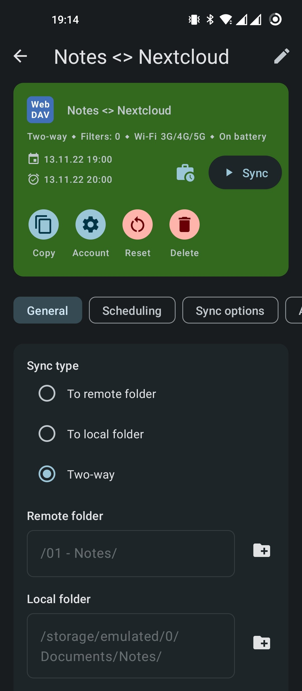

# Markdown Cross-Platform Setup for Note-Taking 

_Markdown_ is barrier-free and cross-platform. This is a short summary of an example Markdown setup which can be synchronized between Windows or Desktop Linux and Android devices.

## Setup Visual Studio Code (VS Code) as Markdown Note-Taking Tool

**_Visual Studio Code_** allows to be set up as the perfect markdown note-taking or (creative) writing tool for any kind text-based projects. This allows fast and economical recording of ideas with text, screenshots etc. This summary lists extensions that can be used for an almost perfect markdown experience. The list is frequently updated as usage of VS Code with its extensions might change.
VS Code settings and extensions (settings included) can be synced automatically using a GitHub or Microsoft account


## Extensions

### Markdown

1. **Markdown All in One**
    - [GitHub](https://github.com/yzhang-gh/vscode-markdown) | [Marketplace](https://marketplace.visualstudio.com/items?itemName=yzhang.markdown-all-in-one)
    - Most important settings and functions needed to work with Markdown documents
    
2. **Markdown Preview Enhanced**
    - [GitHub](https://github.com/shd101wyy/vscode-markdown-preview-enhanced) | [Marketplace](https://marketplace.visualstudio.com/items?itemName=shd101wyy.markdown-preview-enhanced)
    - Maybe the most versatile markdown preview package for Atom including scroll sync
  
3. **Markdown Tables**
    - [GitHub](https://github.com/philipparndt/vscode-markdown-tables) | [Marketplace](https://marketplace.visualstudio.com/items?itemName=pharndt.vscode-markdown-table)
    - Easily create, extend and edit tables in markdown files
  
4. **Paste Image**
    - [Github](https://github.com/mushanshitiancai/vscode-paste-image) | [Marketplace](https://marketplace.visualstudio.com/items?itemName=mushan.vscode-paste-image)
    - Easily copy and paste images from clipboard (includes files and screenshots)

5. **Markdown Meaningful Word Count**
    - [GitHub](https://github.com/akashagarwal7/markdown-meaningful-wordcount) | [Marketplace](https://marketplace.visualstudio.com/items?itemName=akashagarwal.markdown-meaningful-wordcount)
    - Counts words in Markdown files and ignores all punctuation marks

6. **Markdown PDF**
    - [GitHub](https://github.com/yzane/vscode-markdown-pdf) | [Marketplace](https://marketplace.visualstudio.com/items?itemName=yzane.markdown-pdf)
    - Fast conversion of Markdown into pdf files

### Additional Functionality

1. **Code Spell Checker**
    - [Github](https://github.com/streetsidesoftware/vscode-spell-checker) | [Marketplace](https://marketplace.visualstudio.com/items?itemName=streetsidesoftware.code-spell-checker)
    - Spell-checking for code and documents. Can be extended individually with additional languages. English is installed and enabled by default.
    - Recommended example settings to be enable in the settings user interface or in _settings.json_:
        ```
        cSpell.enabled": true,
        "cSpell.language": "en-US,de-DE",
        "cSpell.enabledLanguageIds": [
        "md"
        ],
        "cSpell.maxNumberOfProblems": 10000,
        "cSpell.maxDuplicateProblems": 5000,
        "cSpell.checkLimit": 500000,
        "cSpell.blockCheckingWhenLineLengthGreaterThan": 100000,
        "cSpell.blockCheckingWhenTextChunkSizeGreaterThan": 50000,
        "cSpell.blockCheckingWhenAverageChunkSizeGreaterThan": 500,
        ```

2. **PDF Viewer**
    - [Marketplace](https://marketplace.visualstudio.com/items?itemName=mathematic.vscode-pdf)
    - Simply display pdf files

3. **Sort Lines**
    - [Github](https://github.com/Tyriar/vscode-sort-lines) | [Marketplace](https://marketplace.visualstudio.com/items?itemName=Tyriar.sort-lines)
    - Simply lines alphabetically, helpful for list or suitable text passages

4. **Insert Date String**
    - [Github](https://github.com/jsynowiec/vscode-insertdatestring) | [Marketplace](https://marketplace.visualstudio.com/items?itemName=jsynowiec.vscode-insertdatestring)
    - Insert date and/or time with a pre-defined format, using a keyboard shortcut

5. **ColorTabs**
    - [Github](https://github.com/oreporan/color-tabs-vscode/issues) | [Marketplace](https://marketplace.visualstudio.com/items?itemName=orepor.color-tabs-vscode-ext)
    - Color the active file tab based on a regular expression which is added to the _settings.json_, e.g.:
        ```
            "colorTabs.config":
                [
                    {
                        "regex": ".*\/Meetings\/.*",
                        "color": "#4287f5",
                    },
                    {
                        "regex": ".*json",
                        "color": "#ad0000",
                    },
                    {
                        "regex": "Abbreviations",
                        "color": "#878787",
                    }
                ],
        ```

### Themes & Syntax Highlighting

1. **Atom One Themes**
    - **Light**: [Github](https://github.com/akamud/vscode-theme-onelight) | [Marketplace](https://marketplace.visualstudio.com/items?itemName=akamud.vscode-theme-onelight)
    - **Dark**: [Github](https://github.com/akamud/vscode-theme-onedark) | [Marketplace](https://marketplace.visualstudio.com/items?itemName=akamud.vscode-theme-onedark)
    - Full workbench theming based on _Atom_'s One themes, useful for users switching from _Atom_ to _VS Code_
    - Themes can be set as preferred light and dark themes that are switched according to the host operating system's settings or via a keyboard shortcut
    - _Atom_ allowed to use individual _UI Themes_ and _Syntax Themes_ which is not possible in VS Code, thus I added syntax highlighting adjustments to _settings.json_ match my preferred _Base 16 Tomorrow Light_ syntax theme from _Atom_:
        ```
        "editor.tokenColorCustomizations": {
            "[Atom One Light] [Atom One Dark]": {
                "textMateRules": [
                    {
                        "scope": "markup.bold.markdown",
                        "settings": {
                            "foreground": "#de935f",
                            "fontStyle": "bold"
                        }
                    },
                    {
                        "scope": "markup.italic.markdown",
                        "settings": {
                            "foreground": "#b294bb",
                            "fontStyle": "italic"
                        }
                    }, 
                    {
                        "scope": "markup.bold.markdown markup.italic.markdown",
                        "settings": {
                            "fontStyle": "italic bold",
                        }
                    },               
                    {
                        "scope": "markup.strikethrough.markdown",
                        "settings": {
                            "foreground": "#0000ff",
                            "fontStyle": "strikethrough"
                        }
                    },
                    {
                        "scope": "markup.strikethrough.markdown markup.italic.markdown",
                        "settings": {
                            "foreground": "#0000ff",
                            "fontStyle": "strikethrough"
                        }
                    },
                    {
                        "scope": "markup.strikethrough.markdown markup.bold.markdown",
                        "settings": {
                            "foreground": "#0000ff",
                            "fontStyle": "strikethrough"
                        }
                    },
                    {
                        "scope": "string.other.link.title.markdown",
                        "settings": {
                            "foreground": "#8abeb7",
                            "fontStyle": "bold"
                        }
                    },
                    {
                        "scope": "markup.underline.link.markdown",
                        "settings": {
                            "foreground": "#81a2be",
                            "fontStyle": "bold"
                        }
                    },
                    {
                        "scope": "markup.inline.raw",
                        "settings": {
                            "foreground": "#b8bf6d",
                        }
                    },
                    {
                        "scope": "markup.fenced_code.block.markdown",
                        "settings": {
                            "foreground": "#b8bf6d",
                        }
                    }, 
                    {
                        "scope": "punctuation.definition.bold.markdown",
                        "settings": {
                            "foreground": "#000000",
                            "fontStyle": "bold"
                        }
                    },
                    {
                        "scope": "punctuation.definition.italic.markdown",
                        "settings": {
                            "foreground": "#000000",
                            "fontStyle": "italic"
                        }
                    }             
                ]
            }
        },
        ```

2. **Material Icons**
    - **Product Icons**: [Github](https://github.com/PKief/vscode-material-product-icons) | [Marketplace](https://marketplace.visualstudio.com/items?itemName=PKief.material-product-icons)
        - replace default icons of VS Code when activated
    - **Files Icons**: [Github](https://github.com/PKief/vscode-material-icon-theme) | [Marketplace](https://marketplace.visualstudio.com/items?itemName=PKief.material-icon-theme)
        - replace file and folder icons of VS Code when activated

### Recommended General Settings

Settings can be adjusted using the graphical user interface and will be saved to the _settings.json_ (see below). If _Settings Sync_ is enabled, all changes will be synchronized across devices accordingly. Changes to the settings normally take effect immediately without restarting VS Code or reloading the window. On Windows operating systems, _settings.json_ is located in `%APPDATA%\Code\User\`.

- Change the **menu bar visibility** to compact:
    `"window.menuBarVisibility": "compact",`
- Enable **Auto Save**
    `"files.autoSave": "onFocusChange",`
- **Minimap** settings, can be enabled with a keyboard shortcut:
    `"editor.minimap.enabled": false,`
    `"editor.minimap.showSlider": "always",`
- Remove **editor guides indentation** for a clean editor view:
    `"editor.guides.indentation": false,`
- Remove **folder tree indentation** for a clean folder view:
    `"workbench.tree.renderIndentGuides": "none",`
- Adjust **default font size** on VS Code startup:
    `"editor.fontSize": 14,`
- Adjust **file tab size** to keep all tabs in view:
    `"workbench.editor.tabSizing": "shrink",`
- Enable **zoom by mouse wheel** of the font size in the editor:
    `"editor.mouseWheelZoom": true,`
- Enable **snippet completion** by Tab:
    `"editor.tabCompletion": "on",`
- Recommended settings to keep the **ruler** of the editor nice and clean:
    `"editor.overviewRulerBorder": false,`
    ```
    "workbench.colorCustomizations":
        {
        "editorOverviewRuler.errorForeground": "#00000000",
        "editorOverviewRuler.warningForeground": "#00000000",
        "editorOverviewRuler.infoForeground":"#00000000"
        },
    ```
- Change the **spell-check mistake color** to red:
    ```
    "workbench.colorCustomizations":
        {
        "editorInfo.foreground": "#ff0000",
        }
    ```

### Recommended Custom Keyboard Shortcuts

Keyboard shortcuts can be adjusted and added individually in the _keybindings.json_ file which is accessible through a user-friendly user interface as well. On Windows
Adjustments for the described VS Code setup as follows in the below table. Please note that these settings will require deleting other keyboard shortcuts to avoid inconsistencies. It is possible to easily display duplicate shortcuts in the keyboard shortcuts user interface. _keybindings.json_ is located in `%APPDATA%\Code\User\`.

| Action                         | Extension | Environment |                            Shortcut                            |
|:------------------------------ |:---------:|:-----------:|:--------------------------------------------------------------:|
| Open Settings                  |           |      X      |                 <kbd>Ctrl</kbd> + <kbd>,</kbd>                 |
| Open Keyboard Shortcuts        |           |      X      | <kbd>Ctrl</kbd> + <kbd>K</kbd>, <kbd>Ctrl</kbd> + <kbd>S</kbd> |
| Open Extensions Overview       |           |      X      |        <kbd>Ctrl</kbd> + <kbd>Shift</kbd> + <kbd>X</kbd>       |
| Toggle Problems                |           |      X      |        <kbd>Ctrl</kbd> + <kbd>Shift</kbd> + <kbd>M</kbd>       |
| Command Palette                |           |      X      |        <kbd>Ctrl</kbd> + <kbd>Shift</kbd> + <kbd>P</kbd>       |
| Toggle Zen Mode                |           |      X      |        <kbd>Ctrl</kbd> + <kbd>Shift</kbd> + <kbd>Z</kbd>       |
| Toggle Light/Dark Theme        |           |      X      |        <kbd>Ctrl</kbd> + <kbd>Shift</kbd> + <kbd>T</kbd>       |
| Snippet Completion             |           |      X      |                         <kbd>Tab</kbd>                         |
| Editor: Increase Font Size     |           |      X      |                 <kbd>Ctrl</kbd> + <kbd>+</kbd>                 |
| Editor: Decrease Font Size     |           |      X      |                 <kbd>Ctrl</kbd> + <kbd>-</kbd>                 |
| Editor: Font Size Reset        |           |      X      |                 <kbd>Ctrl</kbd> + <kbd>0</kbd>                 |
| Editor: Enable/Disable Minimap |           |      X      |                 <kbd>Ctrl</kbd> + <kbd>M</kbd>                 |
| Editor: Move Line Up           |           |      X      |                 <kbd>Ctrl</kbd> + <kbd>↑</kbd>                 |
| Editor: Move Line Down         |           |      X      |                 <kbd>Ctrl</kbd> + <kbd>↓</kbd>                 |
| Markdown Bold                  |     X     |             |                 <kbd>Ctrl</kbd> + <kbd>B</kbd>                 |
| Markdown Italic                |     X     |             |                 <kbd>Ctrl</kbd> + <kbd>I</kbd>                 |
| Markdown Strikethrough         |     X     |             |        <kbd>Ctrl</kbd> + <kbd>Shift</kbd> + <kbd>S</kbd>       |
| Markdown Code Span             |     X     |             |        <kbd>Ctrl</kbd> + <kbd>Shift</kbd> + <kbd>#</kbd>       |
| Markdown Code Block            |     X     |             |        <kbd>Ctrl</kbd> + <kbd>Shift</kbd> + <kbd>+</kbd>       |
| Markdown: Toggle Task          |     X     |             |                  <kbd>Alt</kbd> + <kbd>C</kbd>                 |
| Open Markdown Preview          |     X     |             |        <kbd>Ctrl</kbd> + <kbd>Shift</kbd> + <kbd>V</kbd>       |
| Markdown Table: Enable/Disable |     X     |             | <kbd>Ctrl</kbd> + <kbd>Q</kbd>, <kbd>Ctrl</kbd> + <kbd>Q</kbd> |
| Markdown Table: Next Cell      |     X     |             |                         <kbd>Tab</kbd>                         |
| Markdown Table: Previous Cell  |     X     |             |                <kbd>Shift</kbd> + <kbd>Tab</kbd>               |
| Markdown PDF: Export File      |     X     |             |        <kbd>Ctrl</kbd> + <kbd>Shift</kbd> + <kbd>E</kbd>       |
| Paste Image                    |     X     |             |         <kbd>Ctrl</kbd> + <kbd>Alt</kbd> + <kbd>V</kbd>        |
| Insert Date                    |     X     |             |                 <kbd>Ctrl</kbd> + <kbd>D</kbd>                 |
| Insert Date & Time             |     X     |             |        <kbd>Ctrl</kbd> + <kbd>Ctrl</kbd> + <kbd>D</kbd>        |
| Sort Lines                     |     X     |             |                          <kbd>F9</kbd>                         |

### Configuring User Snippets

Text snippets for fast input can be specified in the _snippets.code-snippets_ file which is accessible via Manage > Configure User Snippets.

_snippets.code-snippets_ is located in `%APPDATA%\Code\User\snippets\`. Snippets are defined under a snippet name which has at least a _prefix_ and a _body_. Snippets can be called by typing the prefix and hitting <kbd>Tab</kbd>.

```
"Snippet Name":
    {
	    "prefix": "SN",
	    "body":
            [
	            "Long Snippet Name"
            ],
    },
```

## Cloud Synchronization of your Notes

As all files are simple text-based and cross-platform markdown _.md_ files, synchronization can easily be done with any cloud (e.g. Google Drive, OneDrive, Nextcloud, OwnCloud). All files and assets (e.g. media) are referenced relatively.

## Android Setup

For Android and Nextcloud users, the combined use of _FolderSync_ and _Markor_ is suggested.

1. **Synchronization with _[FolderSync Pro](https://play.google.com/store/apps/details?id=dk.tacit.android.foldersync.full&hl)_**

	_FolderSync_ is an Android App which allows to create one-way or two-way synchronization profiles between the local device and numerous cloud providers. Additional protocols include (S)FTP, SMB and WebDAV. The latter is suitable to create sync profiles with _Nextcloud_. Sync can be set up to on schedule e.g. every 30 minutes, but can also combined with a sync immediately when files are changed on the Android device

	<p align="center">
	
	</p>

2. **Editing/Viewing markdown files with _[Markor](https://play.google.com/store/apps/details?id=net.gsantner.markor)_**

	Markor allows editing and viewing files in markdown or todo.txt formats.

	<p align="center">
	
	</p>
