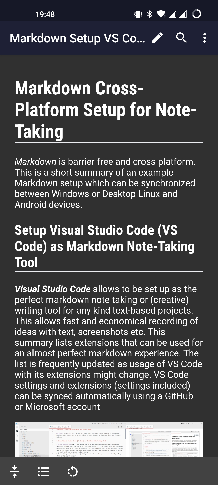

# Markdown Cross-Device Setup for Note-Taking

Markdown is barrier-free and cross-platform. This is a short summary of an example Markdown setup which can be synchronized between Windows or Desktop Linux and Android devices.

## Setup Atom as Markdown Note-Taking Tool

**_Atom_** allows to be set up as the perfect markdown note-taking or (creative) writing tool for any kind text-based projects. This allows fast and economical recording of ideas with text, screenshots etc. This repository summarizes a list of packages that I use for my perfect markdown setup. The list is frequently updated as usage of Atom with its packages might change.


## Packages

1. **[sync-settings](https://atom.io/packages/sync-settings)**
   - Manually backup Atom settings via Menu > Packages > Synchronize Settings
   - Automatic Check/Restore
   - Includes packages, keymaps and snippets
   - _Personal Access Token_ and _(Secret) Gist ID_ needed
   - _This will be the only package you will need to install if you want to restore your Atom setup on new device_
2. **[language-gfm](https://atom.io/packages/language-gfm)**
	 - Installed by default, Github Flavored Markdown
3. **[markdown-writer](https://atom.io/packages/markdown-writer)**
   - Add features to Atom for better Markdown experience
4. **[markdown-preview-enhanced](https://atom.io/packages/markdown-preview-enhanced)**
   - Maybe the most versatile markdown preview package for Atom including scroll sync
5. **[markdown-table-editor](https://atom.io/packages/markdown-table-editor)**
   - Easily create and extend tables in markdown files
6. **[markdown-image-insert](https://atom.io/packages/markdown-image-insert)**
   - Take a screenshot and paste it into markdown files via <kbd>Ctrl</kbd>+<kbd>Alt</kbd>+<kbd>V</kbd>
   - Images will be saved automatically to a _Media_ subfolder of the corresponding markdown file location
7. **[toggle-markdown-task](https://atom.io/packages/toggle-markdown-task)**
   - Toggle checkbox via keyboard shortcut, must be adjusted in keymap to avoid conflict with _date-plus_ package
8. **[pdf-view](https://atom.io/packages/pdf-view)**
   - Allows viewing pdf files in Atom
9. **[markdown-themeable-pdf](https://github.com/cakebake/markdown-themeable-pdf)**
   - This package is _archived_ and no longer maintained, but still works without issues. It has to be installed manually.
   - Allows exporting markdown files to pdf and other file formats
   - _styles.css_, _header.js_ and _footer.js_ file can be adjusted to fit the user's export style (see below)
   - <kbd>Ctrl</kbd>+<kbd>Shift</kbd>+<kbd>E</kbd> to export the current markdown file
10. **[autosave](https://atom.io/packages/autosave)**
    - Automatically save file when it loses focus in Atom
11. **[date-plus](https://atom.io/packages/date-plus)**
    - Allows to define auto-insert date and time via keyboard shortcut, must be adjusted in keymap to avoid conflict with _toggle-markdown-task_ package
12. **[delete-whitelines](https://atom.io/packages/Delete-Whitelines)**
    - Delete empty lines by <kbd>Alt</kbd>+<kbd>Shift</kbd>+<kbd>D</kbd>
13. **[sort-lines](https://atom.io/packages/sort-lines)**
    - Sort marked lines by pressing <kbd>F5</kbd>
14. **[tool-bar](https://atom.io/packages/tool-bar)**
    - Toggle visibility via <kbd>Ctrl</kbd>+<kbd>Alt</kbd>+<kbd>T</kbd>
15. **[flex-toolbar](https://atom.io/packages/flex-tool-bar)**
    - Allows to create tailor-made toolbars with any commands available in Atom
16. **[file-icons](https://atom.io/packages/file-icons)**
    - Display icons for file types in project folder and tabs
17. **[line-count-status](https://atom.io/packages/line-count-status)**
	  - Display number of lines of the current file in the status bar
18. **[wordcount](https://atom.io/packages/wordcount)**
    - Display number of words and characters of the current file
19. **[Zen](https://atom.io/packages/wordcount)**
    - Toggle distraction-free writing by pressing <kbd>Shift</kbd>+<kbd>F11</kbd>
20. **[spell-check](https://atom.io/packages/spell-check)**
    - Adds spell-check for any language, multiple languages can be added
21. **[minimap](https://atom.io/packages/minimap)**
    - Sidebar with full file preview
    - Toggle on/off via <kbd>Ctrl</kbd>+<kbd>Space</kbd>
22. **[color-tabs](https://atom.io/packages/color-tabs)**
    - add the ability to manually add color to tabs
    - should be combined with [color-tabs-regex](https://atom.io/packages/color-tabs-regex) for automatic coloring
23. **[color-tabs-regex](https://atom.io/packages/color-tabs-regex)**
    - automatically color tabs based on rules set in _~/.atom/color-tabs-regex.cson_

### Adjustments for markdown-themeable-pdf

Files are located in `/.atom/markdown-themeable-pdf/` by default. Images for header or footer have to be placed in the same folder. I changed the settings to store these files in `/.atom/` and add `header.js`, `footer.js` as well as `logo.png` to the list of _extra files_ to be synchronized to the Gist by _Sync Settings_.

- **header.js**
	```
	module.exports = function (info) {
	    var dateFormat = function () {
	        return (new Date()).toLocaleDateString('de-DE', {
	            weekday: 'long',
	            year: 'numeric',
	            month: 'long',
	            day: 'numeric',
	        });
	    };
	  	return {
	        height: '2cm',
	        contents: ''+'</strong><div style="float:right;vertical-align:middle">' + dateFormat() + ' (Name)</div>'
	    };
	};
	```
- **footer.js**
	```
	module.exports = function (info) {
	    return {
	        height: '1cm',
	        contents: '<div style="float:right;">{{page}}/{{pages}}</div>'
	    };
	};
	```
- **styles.css**
	```
	hr {
	    border-top: 2px solid #EEE;
	}

	h1, h2 {
	    border-bottom: none;
	}

	#pageFooter {
	    border-top: none;
	}
	```

### Adjustments for flex-toolbar
The _flex-toolbar_ package creates a `toolbar.cson` file in _/.atom/_ which needs to be added to the list of _extra files_ to be synchronized to the Gist by _Sync Settings_. Buttons can be added as described below.

```
[
  {
    type: "button"
    icon: "gear"
    tooltip: "Atom Settings"
    callback: "settings-view:open"
  }
]
```
### Adjustments for color-tabs and color-tabs-regex
The _color-tabs-regex_ package creates a `color-tabs-regex.cson` file in _/.atom/_. Based on file ending or naming, colors can be defined. File should be created with a new line for each rule, e.g.:

```
".md": "rgb(66, 135, 245)"
```

### Keymap Adjustments
Keyboard shortcuts can be adjusted and added individually in the *keymap.cson* file which is accessible via File > Keymap...
Adjustments for the described Atom setup as follows:
```
'atom-text-editor':
  'ctrl-d': 'date-plus:date'
  'ctrl-alt-d': 'date-plus:time'

'atom-workspace, atom-workspace atom-text-editor':
  'ctrl-shift-e': 'markdown-themeable-pdf:export'

'atom-workspace, atom-text-editor':
  'ctrl-shift-d': 'toggle-markdown-task:toggle'

'atom-text-editor:not(.mini):not(.autocomplete-active).markdown-table-editor-active':
  'ctrl-alt-j'          : 'markdown-table-editor:insert-column'
  'ctrl-alt-k'          : 'markdown-table-editor:delete-column'
  'ctrl-alt-g'          : 'markdown-table-editor:insert-row'
  'ctrl-alt-h'          : 'markdown-table-editor:delete-row'

'atom-text-editor:not([mini])':
  'ctrl-tab': 'snippets:expand'

'atom-workspace, atom-text-editor, minimap-quick-settings':
  'ctrl-space': 'minimap:toggle'
```

### Snippets Adjustments

Text snippets for faster input can be specified in the *snippets.cson* file which is accessible via File > Snippets...
For Markdown files, snippets can be referenced starting with `'.source.gfm':`. This is followed by the name of the snippet, the short version (`'prefix': '...'`) and the complete body of the snippet (`'body': '...'`).

```
'.source.gfm':
  'My first Snippet':
      'prefix': 'mfs'
      'body': 'My first Snippet'
```

## Cloud Synchronization of your Notes

As all files are simple text-based and cross-platform markdown _.md_ files, synchronization can easily be done with any cloud (e.g. Google Drive, OneDrive, Nextcloud, OwnCloud). All files and assets (e.g. media) are referenced relatively.

## Android Setup

For Android and Nextcloud users, the combined use of _FolderSync_ and _Markor_ is suggested.
1. Synchronization with **[FolderSync Pro](https://play.google.com/store/apps/details?id=dk.tacit.android.foldersync.full&hl)**

	FolderSync is an Android App which allows to create one-way or two-way synchronization profiles between the local device and numerous cloud providers. Additional protocols includes (S)FTP, SMB and WebDAV. The latter is suitable to create sync profiles with Nextcloud. Sync can be set up to on schedule e.g. every 30 minutes, but can also combined with a sync immediately when files are changed.


	<p align="center">
	
	</p>

2. Editing/Viewing markdown files with **[Markor](https://play.google.com/store/apps/details?id=net.gsantner.markor)**

	Markor allows editing and viewing files in markdown or todo.txt formats.

	<p align="center">
	
	</p>
